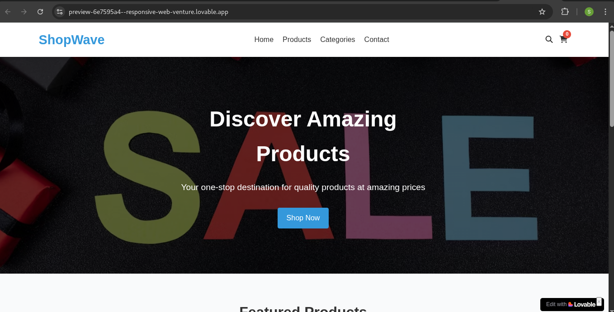

# My Blog Website - Final Project

## 🔥 Description
This is a responsive blog website built as my final project. It shares my coding journey, including challenges, milestones, and projects.

## 🌐 Live Demo
[Click to view live site](https://your-username.github.io/MyBlogProject/)

## 📁 Technologies Used
- HTML5
- CSS3 (Responsive Design)
- JavaScript (Interactivity)
- Git & GitHub for version control

## 💻 Features
- Fully responsive design
- Interactive "Read More" button
- Full-screen background image
- Navigation across pages (Home, About, Contact)

## 📷 Preview

## 🧠 Author
Serphne Adhiambo
